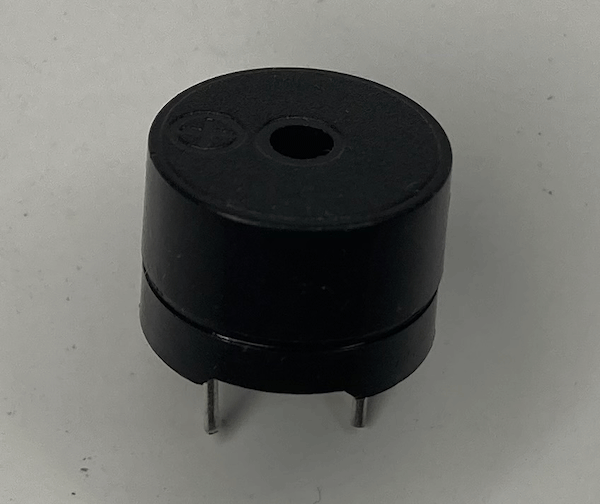

## أصدِر ضوضاءً

تُصدر مفرقعات الحفلة ضوضاء! في هذه الخطوة ، ستقوم بتوصيل ** الجرس السلبي ** بـ Raspberry Pi Pico الخاص بك وترميزه لتشغيل صوت عند سحب المفرقعات. 

! [صورة تظهر جرس بيزو سلبي متصل بـ Raspberry Pi Pico.] (images / rgb-buzzer.gif) {: width = "300px"}

هناك نوعان رئيسيان من الجرس ، جرس ** نشط ** وجرس ** سلبي **. يُصدر الجرس ** النشط ** دائمًا نفس النغمة. يمكن للجرس ** السلبي ** تشغيل مجموعة متنوعة من النغمات. يتطلب اتصالاً وإشارة معينة لتشغيل النغمة المختارة. 

[[[buzzers-speakers]]]

--- task ---

لاحظ أن للجرس ساق طويلة وساق قصيرة. تمامًا كما هو الحال مع مصابيح LED ، فإن الساق الطويلة هي الساق الموجبة (+) والساق القصيرة هي الساق الأرضية (-). إذا كانت أرجل الجرس متشابهة تمامًا في الارتفاع ، فقم بإلقاء نظرة على الجزء العلوي من الجرس وابحث عن الرمز (+).

{:width="300px"}

--- /task ---

--- task ---

**قم بتوصيل** الجرس بـ Raspberry Pi Pico باستخدام سلكين توصيل **مقبس- مقبس**. قم بتوصيل الساق الطويلة بـ **GP5**، والساق القصيرة بالدبوس **GND** (الأرضي) القريب.

--- /task ---

يمكن للبشر سماع الأصوات في نطاق 20 هرتز (منخفض جدًا) إلى 20000 هرتز (مرتفع جدًا). يمكن للأطفال والشباب سماع أصوات أعلى من كبار السن. تتوافق النوتات الموسيقية مع ** ترددات صوتية معينة ** ؛ على سبيل المثال ، يبلغ متوسط C (C4) حوالي 262 هرتز. Hz ، اختصار لـ Hertz ، هو عدد الاهتزازات في الثانية. سيؤدي إرسال الإشارة الصحيحة إلى الجرس إلى جعله يهتز بتردد معين ، والذي ستسمعه كنغمة موسيقية. 

--- task ---

**اختبار:** قم بتحديث البرنامج النصي `party_popper.py` ليطابق التالي ، ثم قم بتشغيل الكود الخاص بك لاختبار الجرس. **تذكر** استيراد `speaker` في **سطر 1**.

--- code ---
---
language: python filename: party_popper.py line_numbers: true line_number_start: 1
line_highlights: 1, 5, 10
---
from picozero import RGBLED, Speaker from time import sleep

rgb = RGBLED(red=1, green=2, blue=3) # Pin numbers speaker = Speaker(5)

def pop(): print("Pop") # Print to the shell rgb.color = (255, 0, 255) # Purple speaker.play(262, 1) # 262 = note C4, for 1 second rgb.off()

pop() --- /code ---

--- /task ---

تتمتع مفرقعات الحفلة بالضوء والصوت. بعد ذلك، قم بإنشاء مجموعة مثيرة للاهتمام من الأضواء والأصوات التي سيتم تنشيطها عند تشغيل مفرقعات الحفلة. في هذا المثال ، نقوم بإنشاء "Ta-da!" صوت الاحتفال مع وميض LED أرجواني في الوقت المناسب مع التأثير.

--- task ---

غيّر النص البرمجي `party_popper.py` ليطابق ما يلي:

--- code ---
---
language: python filename: party_popper.py line_numbers: true line_number_start: 1
line_highlights:  10-15
---
from picozero import RGBLED, Speaker from time import sleep

rgb = RGBLED(red=1, green=2, blue=3) # Pin numbers speaker = Speaker(5)

def pop(): print("Pop") # Print to the shell rgb.color = (255, 0, 255) # Purple speaker.play(262, 0.1) # 262 = note C4, 0.1 seconds rgb.color = (0, 0, 0) # LED no colour – off sleep(0.1) rgb.color = (255, 0, 255) # Purple speaker.play(262, 0.6) # Note C4, 0.6 seconds rgb.off()

pop()

--- /code ---

--- /task ---

--- task ---

**اختبار:** قم بتشغيل الكود الخاص بك لمعرفة ما إذا كان "Ta-da!" يتم تشغيل المؤثرات الصوتية ويومض LED في الوقت المناسب.

{:width="300px"}

--- /task ---

--- task ---

**التصحيح:**

--- collapse ---

---
title: أرى الرسالة `لم يتم تعريف مكبر الصوت`
---

أضف `، speaker` إلى نهاية السطر 1.

--- /collapse ---

--- collapse ---

---
title: لا تظهر الرسالة "Pop" في الغلاف
---

تحقق من وحدة تحكم Thonny بحثًا عن أي رسائل خطأ وقم بإصلاح الرمز الخاص بك بحيث يبدو تمامًا مثل المثال.

--- /collapse ---

--- collapse ---

---
title: RGB LED لا يضيء
---

إذا لم يضيء RGB LED:
+ تحقق من أن أسلاك العبور متصلة بالمسامير الصحيحة
+ تحقق من عدم وجود أي اتصالات مفقودة
+ تحقق من أن مؤشر LED لم ينفجر

--- /collapse ---

--- collapse ---

---
title: لا يصدر الجرس صوتًا
---

إذا لم يصدر الجرس صوتًا:
+ تحقق من أن أسلاك العبور متصلة بالمسامير الصحيحة
+ تحقق من عدم وجود أي اتصالات مفقودة
+ تحقق من أنك تقوم بتشغيل تردد يمكنك سماعه: يجب أن تتراوح القيم بين 15 و 15000
+ تأكد من أنك تستخدم صفارة **سلبية**

--- /collapse ---

--- /task ---
