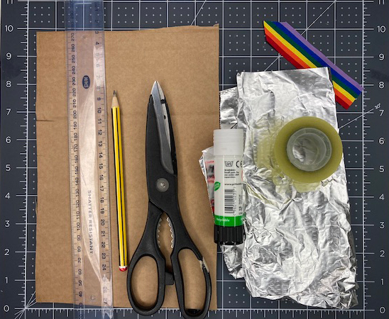
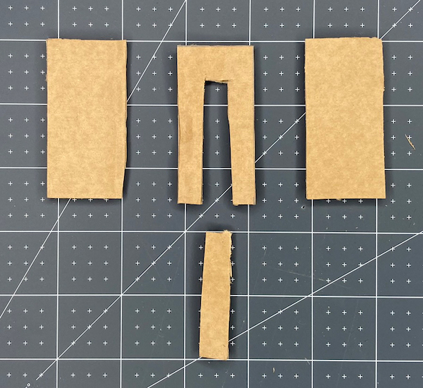

## قم بصنع مفتاح التشغيل الخاص بك

قم بصنع مفتاح لتنشيط مفرقعات الحفلة باستخدام البطاقة المموجة والغراء وورق المطبخ.

{:width="300px"}

--- task ---

الآن بعد أن عرفت أن الكود الخاص بك يعمل ، فأنت بحاجة إلى إجراء التبديل الذي سيؤدي إلى تشغيل مفرقعات الحفلة!

اجمع المواد الخاصة بك:

- مقص
- بطاقة مموجة
- ورق الالمنيوم الخاص بالطبخ
- عصا الغراء
- بعض الشريط اللاصق

**اختياري**:

- قلم رصاص ومسطرة (إذا كنت تريد أن تكون أكثر دقة في صنعك)
- بعض الشريط أو الخيط أو الورق / البطاقة الملونة أو الورق العادي الذي قمت بتلوينه

--- /task ---

--- task ---

اقطع البطاقة المموجة إلى ثلاثة مستطيلات بنفس الحجم. يمكنك تحديد حجم مفرقعات الحفلة الخاصة بك. المثال 3 سم × 5 سم.

**نصيحة**: إذا لم يكن لديك قلم رصاص ومسطرة ، فقم بقص الأول واستخدمه كقالب للاثنين الآخرين.

--- /task ---

--- task ---

قص مقطعًا من منتصف أحد المستطيلات. احتفظ بقطعة البطاقة التي قطعتها حيث سيتم استخدامها لاحقًا.

--- /task ---

--- task ---

**خذ ورق المطبخ** بنفس حجم المستطيلات غير المقطوعة.

**صمغ** الورق المقوى وأرفق ورق الالمنيوم الخاص بالطبخ.

**نصيحة:** تأكد من أنك لا تحصل على الكثير من الغراء على الجزء الخارجي من ورق الالمنيوم لأنه سيؤثر على جهات اتصال المفتاح.

--- /task ---

--- task ---

خذ قطعة البطاقة التي أزلتها من المستطيل المركزي وقم بقص الجزء العلوي على شكل V أو نقطة لتسهيل وضعها داخل المفرقعات الخاصة بك.

**قم بقص** الجوانب ببضعة مليمترات للتأكد من أنها تتناسب بسهولة مع آلة التقطيع.

--- /task ---

--- task ---

قم بتغطية القطعة التي تم إزالتها **بورق الالمنيوم**. من المهم جدًا أن تستخدم قطعة واحدة من ورق الألمنيوم وأن يتم لفها بالكامل. هذا ما سيجعل المفتاح يغلق ويسمح للتيار بالتدفق.

--- /task ---

--- task ---

**افصل Raspberry Pi Pico الخاص بك من جهاز الكمبيوتر الخاص بك.**

**قم بإزالة** من سلكي العبور المتصلين بالمسامير **GP18** و **GND**.

استخدم بعض الشريط اللاصق لتثبيته في أعلى كل مستطيل.

**نصيحة:** من المهم أن تقوم المسامير باتصال آمن بورق الالمنيوم. تأكد من وضع كل دبوس بشكل مسطح على الرقاقة بحيث يكون الجزء البلاستيكي من سلك العبور على حافة الورق المقوى.

أضف المزيد من الشريط اللاصق لتأمين سلك العبور وإيقافه من السقوط عن طريق الخطأ.

--- /task ---

--- task ---

**الاختبار**: أعد توصيل أسلاك التوصيل إلى **GP18** و **GND** و Raspberry Pi Pico مرة أخرى إلى جهاز الكمبيوتر الخاص بك ، ثم **قم بتشغيل** التعليمات البرمجية الخاصة بك.

أغلق وافتح المفتاح عن طريق لمس المستطيلين المحبطين معًا ، ثم احباطه. سيتم تشغيل RGB LED والجرس عند فتح المفتاح.

--- /task ---

--- task ---

**تصحيح:**

--- collapse ---

---
title: مفرقعات الحفلة تنطلق باستمرار
---

+ تأكد من أن الأسلاك الخاصة بك آمنة حقًا
+ تأكد من أن أصابعك لا تلمس الرقاقة أثناء الاختبار حيث يمكن لجسمك أن يكمل الدائرة ويفككها ويتسبب في انطفاءها
+ إذا استمر حدوث هذا الخطأ ، فحاول إعادة تشكيل البطاقات المستطيلة وأغلفة الرقائق

--- /collapse ---

--- collapse ---

---
title: المفتاح لا ينشط المفرقعات
---

+ تحقق من أن أسلاك العبور متصلة بالمسامير الصحيحة
+ تحقق من التوصيلات بين المسامير الموجودة على أسلاك العبور وأن الرقاقة صلبة على كلا الجانبين
+ أغلق المفتاح وافتحه للتأكد من تشغيل الحدث
+ تأكد من تطابق الكود الخاص بك مع المثال ومن أنك قمت بالنقر فوق **تشغيل**

--- /collapse ---

--- /task ---

--- task ---

**افصل Raspberry Pi Pico الخاص بك من جهاز الكمبيوتر الخاص بك.**

**قم بإزالة** الأسلاك من دبابيس **GP18** و **GND** مرة أخرى حتى تتمكن من إكمال المفرقعات الخاصة بك.

أضف الغراء إلى جانب واحد من قطعة الورق المقوى التي أزلت المنتصف منها وألصقها بالجانب المغطى بورق الألمنيوم من المستطيل الأيسر.

ستخلق هذه الطبقة حاجزًا بين قطعتين من الرقائق وتتيح مساحة لوضع القطعة المركزية بداخلها.

--- /task ---

--- task ---

أضف الصمغ إلى الجانب الآخر من قطعة الورق المقوى التي أزلت المنتصف منها ، وألصق الوجه المعدني للمستطيل الآخر في الأعلى. تأكد من أن قطعتين من ورق الألمنيوم **لا تلامس**. قد تحتاج إلى قص الرقائق المعدنية إذا كانت متداخلة.

--- /task ---

--- task ---

**تصحيح**:

- افصل Raspberry Pi Pico الخاص بك من جهاز الكمبيوتر الخاص بك
- أعد توصيل أسلاك التوصيل بـ **GP18** و **GND**
- ضع القطعة المركزية داخل المفرقعات لتشكيل اتصال (غلق المفتاح)
- **اختبار:** قم بتشغيل التعليمات البرمجية الخاصة بك
- يجب تشغيل الكود عند إزالة القطعة المركزية من المفرقعات

--- /task ---

--- task ---

**تصحيح**:

--- collapse ---

---
title: المفتاح لا ينشط المرفقعات
---

+ تحقق من أن أسلاك العبور متصلة بالمسامير الصحيحة
+ تحقق من التوصيلات بين المسامير الموجودة على أسلاك العبور وأن الرقاقة صلبة على كلا الجانبين
+ ادفع القطعة الوسطى داخل المفرقعات الخاصة بك واسحبها للخارج مرة أخرى لتحريك الحدث
+ تحقق من أن أجزاء الرقاقة الموجودة على الأجزاء الخارجية للبطاقة لا تلامس بشكل دائم
+ تأكد من النقر فوق **تشغيل**

--- /collapse ---

--- /task ---

--- task ---

**اختياري**: أضف بعض الشريط أو البطاقة الملونة أو الخيط أو أي شيء ملون إلى نهاية القطعة المركزية. سيجعل هذا الأمر أكثر متعة في سحب مفرقعات الحفلة!

--- /task ---
