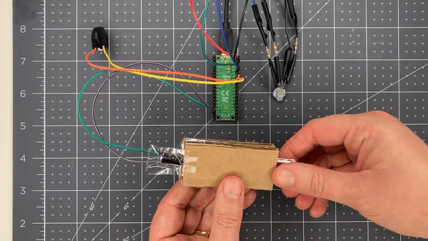

## Introduction

Make a reusable party popper that rewards you with a light and sound display when it is pulled.

Party poppers are famously used to celebrate special occasions all around the world. They usually have a piece of string that can be pulled to make a loud sound and release some confetti into the air. If you haven't seen one before, you might recognise the party popper emoji!

{:width="300px"}

You will:

+ Code RGB LEDs to light in different colours and fade out. 
+ Create a sound effect.
+ Make a contact switch out of card, foil and string.

### You will need:

**Hardware:**
+ A Raspberry Pi Pico with pin headers soldered on  
+ A **data** USB A to micro USB cable
+ A **passive** buzzer
+ 1 x RGB LEDs (a standard LED will work, but the code will be a little different)
+ X x socket-socket jumper wires
+ Corrugated card
+ String, ribbon or coloured paper
+ Several pieces of paper
+ Kitchen foil 
+ Sticky tape or duct tape

**Software:**
+ Thonny - this project can be completed using the Thonny Python editor which can be installed on a Linux, Windows or Mac computer.

[[[thonny-install]]]

[[[change-theme-thonny]]]

--- no-print ---
--- task ---
  
**Watch**: This example shows a party popper that triggers a coloured light show along with some sound. 

--- /task ---
--- /no-print ---

--- print-only ---

--- /print-only ---
