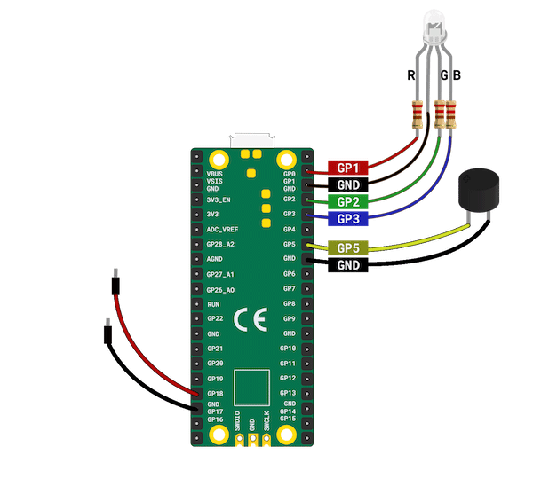
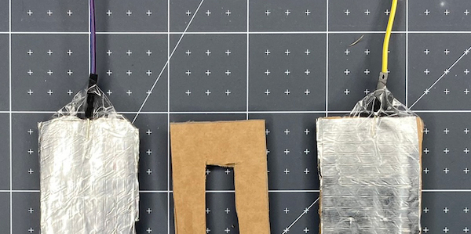

## Make your switch

Create a pull switch to activate your party popper.

{:width="300px"}

Technology is finding its way into all sorts of celebrations worldwide, creating lots of sustainable and reuable options for all kinds of fun displays and interactive entertainments. Now instead of disposable items like plastic party poppers or chemical fireworks, people are celebrating with drones, lasers and projection shows!

--- task ---

Get 2 x socket-pin jumper wires to be used for your pull switch. 

**Connect:** Connect one jumper wire to **GP18** and one to the **GND** pin next to it. 

--- /task ---

In the LED Firefly project you checked `is_closed` in a loop to run different code if your switch was closed or open. Instead of checking in a loop, you can get `picozero` to call a function when a switch is opened or closed using `when_opened` and `when_closed`. 

There are two ways that you can run code based on the state of an input such as a Switch. You can use a loop and keeping checking the state of the input to see if it `is_open` or `is_closed`, this is called polling. Or, you can ask `picozero` to call a function when an input changes state, using events such as `when_opened` and `when_closed`. Using events can make your code simpler to write and understand and means that input changes can be detected when they happen and won't be missed if you don't poll (check) the input at the right time. 

--- task ---

Add code to call the `pop` function when the pull switch is opened (disconnected).

--- code ---
---
language: python
filename: main.py 
line_numbers: true
line_number_start: 1
line_highlights: 1, 5, 19
---
from picozero import RGBLED, Speaker, Switch
from time import sleep

rgb = RGBLED(red=1, green=2, blue=3) # pin numbers 
pull = Switch(18)
speaker = Speaker(5)

def pop():
    print("pulled")
    c_note = 523
    rgb.color = (255, 125, 0)
    speaker.play(c_note, 0.1)
    rgb.color = (0, 0, 0)
    sleep(0.1)
    rgb.color = (255, 125, 0)
    speaker.play(c_note, 0.6)
    rgb.off()
        
pull.when_opened = pop # The pop function will be called when the pull switch is opened

--- /code ---

**Tip:** Make sure you **don't** add `()` to the end of `pull.when_opened = pop`. This line tells `picozero` that every time the `when_opened` event happens, the `pop` function is called. 

--- /task ---

--- task ---

**Test** your code: 

Your RGB LED should light and the sound should play each time that the switch is **opened**. **Run**your code and make sure that this happens. 

--- /task ---

--- task ---

Now that you know your code is working, you can go ahead and make the party popper switch! First, you need to gather your materials:

- A pair of scissors
- Corrugated card
- Aluminium foil
- A glue stick
- Some sticky tape

**Optional**:

- A pencil and a ruler (if you want to be more precise with your make)
- Some nice ribbon OR string OR coloured paper/card OR plain paper that you have coloured in

--- /task ---

--- task ---

Cut the **corrugated card** into three rectangles that are the same size. You can decide on the size of your party popper. The example is 3cm x 5cm. 

**Tip**: If you don't have a pencil and a ruler then cut the first one and then use it as a template for the other two. 

**Optional**: You don't have to use a rectangle shape, you could do a circle or a rocket or anything you like! You will need to make sure though that you follow similar steps to make the switch close and open as expected. 

--- /task ---

--- task ---

**Cut** a section out of the centre of one of your rectangles. Keep the piece of card that you have cut out as this will be used later. 

--- /task ---

--- task ---

Take the **aluminium foil** and cut it to the same size as the un-cut rectangles. 

Next, **glue** the foil to the rectangles.

--- /task ---

--- task ---

Now take the piece of card that you removed from the centre rectangle and cut a V shape out of the top to make it easier to place it inside your popper.

Next, **trim** the sides by a few millimetres to make sure that it will easily fit into your popper.

--- /task ---

--- task ---

Now, cover the removed piece in **aluminium foil**. It is very important that you use a continuous piece of foil and that it goes all the way around. This is what will make the switch close and allow the current to flow.

--- /task ---

--- task ---

**Remove** the two jumper wires that you used for your test switch above that are attached to **GP18** and the **GND** pin. 

Next, use some sticky tape to secure them to the top of each rectangle. It is important that the pins make a secure contact with the aluminium foil.

--- /task ---

--- task ---

**Test**: At this point it is a good time to test that your connections are secure. 

Attach your jumper wires back to **GP18** and **GND**. 

**Run** your code to see if it works. The RGB LED should light and the tone should play when the switch is open. You can close and open the switch but touching the two foil ends of the rectangle together. 

<mark> add in a gif of this working </mark>

--- /task ---

--- task ---

**Remove** the jumper wires from the **GP18** and **GND** pins again so that you can complete your popper.

Next, go ahead and glue the middle piece to the left rectangle. This will create a barrier between the two pieces of foil and allow space for your centre piece to be placed inside. 

--- /task ---

--- task ---

Next, glue your other foiled rectangle faced down onto the left piece. Make sure that the two pieces of foil are not touching. 

--- /task ---

--- task ---

**Test**: 

- Attach your jumper wires back to **GP18** and **GND**
- Place the centre piece inside the popper to form a connection (close the switch)
- **Run** your code
- The code should run when you remove the centre piece from the popper

<mark> add in a gif of this working </mark>

--- /task ---

--- task ---

**Optional**: Add some ribbon, coloured card, string or anything colourful to the end of your centre piece. This will make it more fun to pull your popper!

--- /task ---

--- save ---

