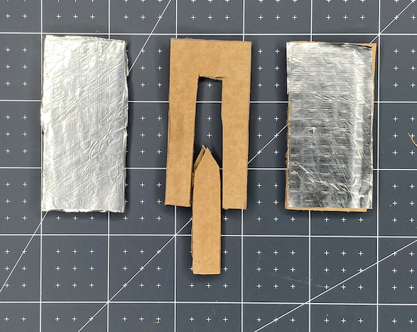
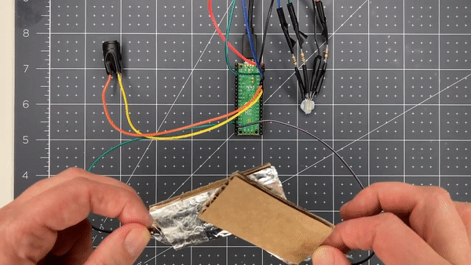

## Fabriquer ton interrupteur

Fabrique un interrupteur pour activer ta bombe de fête en utilisant du carton ondulé, de la colle et du papier d'aluminium.

{:width="300px"}

--- task ---

Maintenant que tu sais que ton code fonctionne, tu dois faire le changement qui déclenchera ta bombe de fête !

Rassemble tes matériaux :

- Une paire de ciseaux
- Du carton ondulé
- Du papier aluminium
- Un bâton de colle
- Du ruban adhésif

**Facultatif** :

- Un crayon et une règle (si tu veux être plus précis avec ce que tu fais)
- Du ruban, de la ficelle, du papier/carte de couleur ou du papier ordinaire que tu as coloré

--- /task ---

--- task ---

Découpe le **carton ondulé** en trois rectangles de même taille. Tu peux décider de la taille de ta bombe de fête. L'exemple est de 3 cm × 5 cm.

**Astuce**: Si tu n'as pas de crayon et de règle, coupe le premier et utilise-le comme gabarit pour les deux autres.

--- /task ---

--- task ---

Découpe une section du centre de l'un de tes rectangles. Conserve le morceau de carton que tu as découpé, car il servira plus tard.

--- /task ---

--- task ---

Prends le **papier d'aluminium** et coupe-le à la même taille que les rectangles non découpés.

**Colle** le carton et fixe la feuille.

**Astuce :** Assure-toi de ne pas mettre trop de colle à l'extérieur de la feuille car cela affectera les contacts de l'interrupteur.

--- /task ---

--- task ---

Prends le morceau de carton que tu as retiré du rectangle central et coupe le haut en forme de V ou en pointe pour faciliter sa mise en place à l'intérieur de ta bombe.

**Coupe** les côtés de quelques millimètres pour t'assurer qu'il s'insérera facilement dans ta bombe.

--- /task ---

--- task ---

Recouvre le morceau retiré de **papier d'aluminium**. Il est très important que tu utilises un morceau de papier d'aluminium et qu'il s'enroule tout autour. C'est ce qui fera fermer l'interrupteur et permettra au courant de circuler.

--- /task ---

--- task ---

**Déconnecte ton Raspberry Pi Pico de ton ordinateur.**

**Retire** les deux fils de liaison attachés aux broches **GP18** et **GND**.

Utilise du ruban adhésif pour les fixer en haut de chaque rectangle.

**Astuce :** Il est important que les broches aient un bon contact avec la feuille d'aluminium. Assure-toi que chaque broche repose à plat contre la feuille avec la partie en plastique du fil de liaison contre le bord du carton.

Ajoute plus de ruban adhésif pour fixer le fil de liaison et l'empêcher de se détacher accidentellement.

--- /task ---

--- task ---

**Test**: Rattache tes fils de liaison à **GP18** et **GND** et ton Raspberry Pi Pico à ton ordinateur, puis **exécute** ton code.

Ferme et ouvre l'interrupteur en touchant les deux rectangles d'aluminium ensemble, feuille à feuille. La LED RVB et le buzzer joueront lorsque l'interrupteur est ouvert.

--- /task ---

--- task ---

**Déboguer :**

--- collapse ---

---
title: La bombe ne cesse de sonner
---

+ Vérifie que tes fils sont bien fixés
+ Assure-toi que tes doigts ne touchent pas la feuille pendant le test car ton corps peut terminer et rompre le circuit et le faire s'éteindre
+ Si cette erreur persiste, essaie de refaire les cartes rectangulaires et les couvertures en aluminium

--- /collapse ---

--- collapse ---

---
title: L'interrupteur n'active pas la bombe
---

+ Vérifie que les fils de liaison sont connectés aux bonnes broches
+ Vérifie que les connexions entre les broches des fils de liaison et la feuille sont solides des deux côtés
+ Ferme et ouvre ton interrupteur pour t'assurer que tu déclenches l'événement
+ Assure-toi que ton code correspond à l'exemple et que tu as cliqué sur **Exécuter**

--- /collapse ---

--- /task ---

--- task ---

**Déconnecte ton Raspberry Pi Pico de ton ordinateur.**

**Retire à nouveau** les fils de liaison des broches **GP18** et **GND** afin de pouvoir terminer ta bombe.

Ajoute de la colle sur un côté du morceau de carton dont tu as retiré le milieu et colle-le sur le côté recouvert de papier d'aluminium du rectangle de gauche.

Cette couche créera une barrière entre les deux morceaux de papier d'aluminium et laissera de l'espace pour que ta pièce centrale soit placée à l'intérieur.

--- /task ---

--- task ---

Ajoute de la colle de l'autre côté du morceau de carton dont tu as retiré le milieu et colle la face en aluminium de ton autre rectangle sur le dessus. Assure-toi que les deux morceaux de feuille **ne se touchent pas**. Tu devras peut-être couper ta feuille si elle se chevauche.

--- /task ---

--- task ---

**Test** :

- Connecte ton Raspberry Pi Pico à ton ordinateur
- Rattache tes fils de liaison à **GP18** et **GND**
- Place la pièce centrale à l'intérieur de la bombe pour former une connexion (fermer l'interrupteur)
- **Exécute** ton code
- Le code doit s'exécuter lorsque tu retires la pièce centrale de la bombe

--- /task ---

--- task ---

**Déboguer** :

--- collapse ---

---
title: L'interrupteur n'active pas la bombe
---

+ Vérifie que les bonnes pattes sont connectées aux bonnes broches
+ Vérifie que les connexions entre les broches des fils de liaison et la feuille sont solides des deux côtés
+ Pousse la pièce du milieu à l'intérieur de ta bombe et tire-la à nouveau pour déclencher l'événement
+ Vérifie que les morceaux de papier d'aluminium sur les morceaux extérieurs de la carte ne se touchent pas en permanence
+ Assure-toi que tu as cliqué sur **Exécuter**

--- /collapse ---

--- /task ---

--- task ---

**Facultatif** : Ajoute un ruban, une carte de couleur, une ficelle ou tout autre élément coloré à la fin de ta pièce centrale. Cela rendra plus amusant de tirer ta bombe de fête !

--- /task ---
